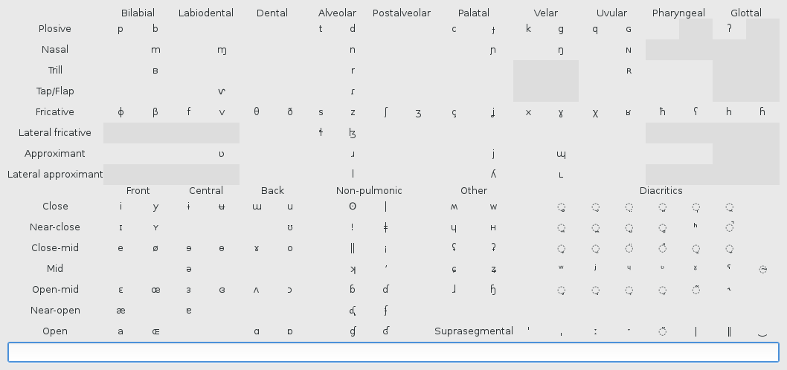

# [Phondue](http://keyboardfire.com/phondue-web/)

*An IPA entry tool so good, it's delicious*

-----

Phondue (pronounced /fɔ̃dy/) is a tool for input of IPA symbols with the primary
goal of being intuitive and easy to use.

[**Try Phondue in your browser here!**](http://keyboardfire.com/phondue-web/)

Compile with `make` from the root of the project, and then run by executing the
`phondue` helper script.

## Usage

As seen in the above screenshot, certain symbols of the IPA can be entered by
clicking on them in the table. However, it is far more efficient to use the
many keyboard shortcuts that Phondue provides. These are called **digraphs**,
since they are made up of two letters, and they allow you to type any IPA
symbol with only a standard keyboard.

These symbols were decided to be intuitive as possible:

- Many symbols that look similar to letters of the English alphabet (such as
  small caps) can be produced by doubling the capital letter:

        GG -> ɢ   ?? -> ʔ   NN -> ɴ
        BB -> ʙ   RR -> ʀ   XX -> χ
        LL -> ʟ   II -> ɪ   YY -> ʏ
        UU -> ʊ   EE -> ɛ   OO -> ɞ
        AA -> ɑ   '' -> ˈ   ,, -> ˌ
        :: -> ː

- The slash is used to "reflect," "rotate," or otherwise flip around a given
  symbol:

        ʀ/ -> ʁ   ʔ/ -> ʕ   ?/ -> ʕ
        r/ -> ɹ   y/ -> ʎ   m/ -> ɯ
        o/ -> ø   e/ -> ə   ɛ/ -> ɜ
        c/ -> ɔ   a/ -> ɐ   ɑ/ -> ɒ
        w/ -> ʍ   h/ -> ɥ   k/ -> ʞ
        !/ -> ¡

    Also note that for any digraph, if either of the two characters that
    compose it are not "standard" letters you can find on your keyboard, the
    digraph can be done in reverse order—so since ʀ/ produces ʁ, you can press
    / again to go back to ʀ in case of accidental flippage (it's also weirdly
    amusing to press RR///////).

    This sometimes makes it easier to enter certain pairs; you may prefer to
    use `AA` for `ɑ` and `AA/` for `ɒ` instead of the visual `o|` and `|o`.

- Digraphs have also been designed for when a symbol looks like two overlayed
  characters, or two characters next to each other. This includes "hooked"
  letters (such as ŋ), produced with the original letter and a comma, and
  "stroked" letters (such as ɟ), produced with the original letter and a dash:

        m, -> ɱ   n, -> ŋ   ŋ, -> ɲ
        v, -> ⱱ   c, -> ç   j, -> ʝ
        x, -> ɣ   ɣ, -> χ   h, -> ɦ
        w, -> ɰ

        j- -> ɟ   h- -> ħ   l- -> ɬ
        i- -> ɨ   u- -> ʉ   e- -> ɘ
        o- -> ɵ   ʕ- -> ʢ   ?- -> ʡ
        ʔ- -> ʡ

        LZ -> ɮ   OX -> ɤ   XO -> ɤ
        OE -> œ   EB -> ɞ   AE -> æ
        CE -> ɶ   RL -> ɺ   LR -> ɺ
        ɾl -> ɺ   lɾ -> ɺ

        w| -> ɰ   o/ -> ø   ɜ( -> ɞ
        /\ -> ʌ   o| -> ɑ   a| -> ɑ
        |o -> ɒ   |a -> ɒ

        o. -> ʘ   |= -> ǂ   || -> ‖
        /^ -> ↗   /> -> ↗   \v -> ↘
        \> -> ↘

- Others are based on pronunciation:

        PH -> ɸ   BH -> β   TH -> θ
        DH -> ð   SH -> ʃ   ZH -> ʒ
        SJ -> ɕ   ZJ -> ʑ   ʃx -> ɧ
        xʃ -> ɧ

    It may be worth noting at this point that digraphs of two lowercase letters
    were intentionally avoided to prevent interference with regular typing. If
    you need to type a sequence without it turning into a digraph (maybe you
    want to type an actual `ʃx`), place a backslash between the two characters
    (so, type `ʃ\x`).

    In fact, [backslash][anything] is treated as a digraph that simply resolves
    to the second character.

- A few digraphs are based on shape:

        rO -> ɾ   r0 -> ɾ
        vO -> ʋ   v0 -> ʋ

    Another related point: digraphs that contain a lowercase letter can also be
    typed with that letter as uppercase. So, if `RO` is easier to type than
    `rO`, that works as well.

- Retroflex and nonpulmonic symbols have their own categories:

        retroflex: ) looks like the shape of the tongue
        t) -> ʈ   d) -> ɖ   n) -> ɳ
        r) -> ɽ   ɾ) -> ɽ   s) -> ʂ
        z) -> ʐ   ɹ) -> ɻ   l) -> ɭ
        ɗ) -> ᶑ

        clicks: clicking noise reminiscent of a *
        o* -> ʘ   |* -> ǀ   !* -> ǃ
        =* -> ǁ

        implosives and ejective marker: direction of airflow
        b( -> ɓ   d( -> ɗ   j( -> ʄ
        ɟ( -> ʄ   g( -> ɠ   ɢ( -> ʛ
        ɖ( -> ᶑ
        ') -> ʼ

- Superscripts and diacritics that go above the letter use `^`, diacritics that
  go below use `_`, and miscellaneous "moved" symbols use `<` or `>`:

        ^h -> ʰ   ^n -> ⁿ   ^l -> ˡ
        ^w -> ʷ   ^j -> ʲ   ^ɥ -> ᶣ
        ^ʋ -> ᶹ   ^ɣ -> ˠ   ^ʕ -> ˤ

        _| -> ◌̩   ^| -> ◌̍
        _o -> ◌̥   ^o -> ◌̊
        _v -> ◌̬   ^v -> ◌̌

        _^ -> ◌̯   _: -> ◌̤   _~ -> ◌̰
        _[ -> ◌̪   _] -> ◌̺   _{ -> ◌̼
        _+ -> ◌̟   __ -> ◌̠
        _) -> ◌̹   _( -> ◌̜
        _# -> ◌̻   [] -> ◌̻

        ^> -> ◌̚   ^: -> ◌̈   ^x -> ◌̽
        ^~ -> ◌̃

        -' -> ˔   _˔ -> ◌̝
        -, -> ˕   _˕ -> ◌̞
        <| -> ⊣   _⊣ -> ◌̘
        >| -> ⊢   _⊢ -> ◌̙

        ~~ -> ◌̴   >r -> ˞

    Note that all of these sequences can be flipped in order—that is, `^h`
    produces the same thing as `h^`. This allows usage such as `|<_` to produce
    `⊣_` which becomes ◌̘.

- Tonal countours use numbers plus `|`:

        1| -> ˥   2| -> ˦   3| -> ˧
        4| -> ˨   5| -> ˩   +| -> ꜛ
        -| -> ꜜ

- Finally, some digraphs simply have unique mnemonics:

        ː-  -> ˑ   "chop off" the bottom triangle
        ((  -> ◌͡◌  two parens for a tie that connects 2 chars
        ))  -> ◌͜◌
        ◌͜◌) -> ‿   one more paren to make it a little bit longer
